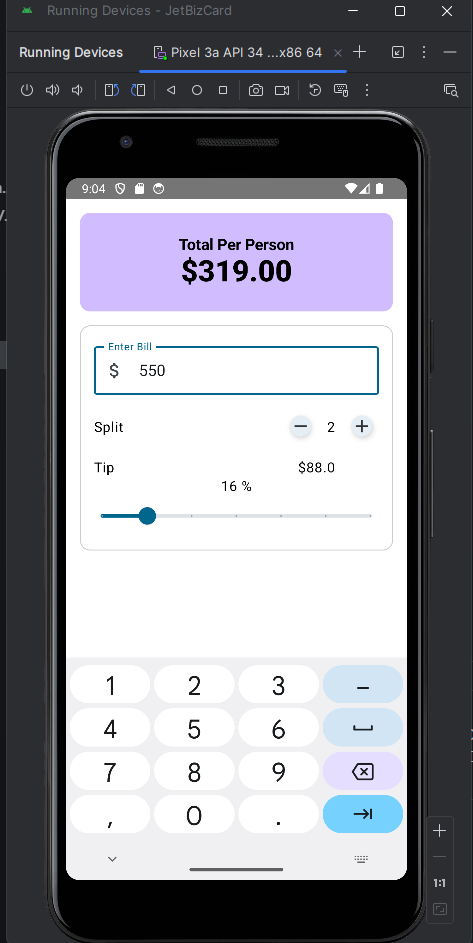

# Tip Calculator

This is a simple tip calculator application built using Kotlin and Jetpack Compose. It allows users to calculate the tip amount for a given bill.

## Features

- Calculate tip based on a percentage of the total bill
- Slider to adjust the tip percentage
- Option to round up or down to the nearest dollar
- Split the bill and tip among multiple people

## Getting Started

These instructions will get you a copy of the project up and running on your local machine for development and testing purposes.

### Prerequisites

- Android Studio Jellyfish | 2023.3.1 or later
- JDK 8 or later

## Screenshots

